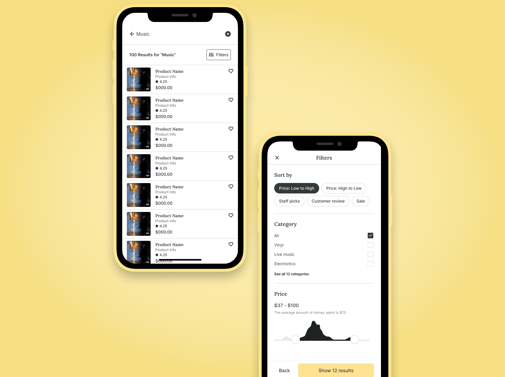

<detalhes>
<summary>
<strong>Read this guide in English</strong>
</summary>
    <ul>
        <li><a href="./README.md">English</a></li>
    </ul>
</detalhes>

## **Screenshots/ Capturas de Tela:**




## **Requisitos do sistema**

- Versão do SDK do Dart 3.0.0 ou superior
- Versão do SDK do Flutter 3.0.0 ou superior.

## **Instalação**

##### 1. Clone o repositório

```bash
git clone https://github.com/edilsonmatola/habitual-ecommerce-app-getx.git
```

##### 2. Navegue até a pasta desejada

```bash
cd habitual-ecommerce-app-getx/
```

##### 3. Crie os aplicativos para Android, iOS e Web

##### 4. Para executar o aplicativo, basta escrever os seguintes comandos:

```bash
flutter pub get
# flutter emulators --launch "emulator_id" (to get Android Simulator)
open -a simulator (to get iOS Simulator)
flutter run
flutter run -d chrome --web-renderer html (to see the best output)
```

### Estrutura do Projecto

Após a compilação ser bem-sucedida, a estrutura do aplicativo deve ficar assim:

```
habitual
├── android
├── assets
├── ios
├── lib
├── linux
├── macos
├── test
├── web
├── windows
├── .gitignore
├── analysis_options.yaml
├── CHANGELOG.md
├── CODE_OF_CONDUCT.MD
├── CONTRIBUTING-PT-BR.md
├── CONTRIBUTING.md
├── pubspec.yml
├── README-PT-BR.md
├── README.md
```

## **Contribuindo**

Contribuições para o aplicativo são bem-vindas! Se você deseja contribuir, por favor, reserve um momento para revisar o arquivo [CONTRIBUIÇÃO](./CONTRIBUTING-PT-BR.md). Este arquivo descreve as diretrizes e processos para contribuir para o Habitual.

Se tiver alguma dúvida ou preocupação sobre o processo de contribuição, não hesite em entrar em contacto comigo [aqui](https://github.com/edilsonmatola/habitual-ecommerce-getx/issues). Eu sempre estou feliz em ajudar novos colaboradores a se actualizarem.

<!-- ## **Licença**

Este projecto está licenciado sob a **Licença MIT**. Consulte o arquivo [LICENSE](./LICENSE) para obter mais detalhes. -->
