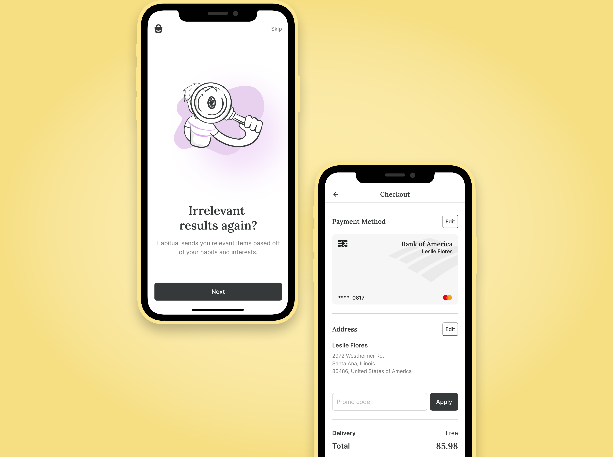

<detalhes>
<summary>
<strong>Read this guide in English</strong>
</summary>
    <ul>
        <li><a href="./README.md">English</a></li>
    </ul>
</detalhes>

- [**Habitual - O Aplicativo de Comércio Eletrônico em Flutter**](#habitual---o-aplicativo-de-comércio-eletrônico-em-flutter)
  - [**Screenshots/ Capturas de Tela:**](#screenshots-capturas-de-tela)
  - [**Páginas Incluídas:**](#páginas-incluídas)
  - [**Dependências:**](#dependências)
  - [**Requisitos do sistema**](#requisitos-do-sistema)
  - [**Instalação**](#instalação)
  - [**Contribuindo**](#contribuindo)
  - [**Licença**](#licença)

# **Habitual - O Aplicativo de Comércio Eletrônico em Flutter**


Habitual é um aplicativo de compras móveis moderno e intuitivo que oferece aos clientes uma experiência de compra fluida e conveniente. Este aplicativo oferece tempos de carregamento rápidos, desempenho confiável e navegação suave. Habitual permite que os usuários naveguem e comprem produtos facilmente.

O aplicativo foi projectado com uma abordagem centrada no usuário, fornecendo uma interface clara e fácil de usar que permite aos usuários encontrar rapidamente os produtos que procuram.

<!-- Se você é um comprador em busca de um aplicativo de compras móveis moderno e confiável, ou um desenvolvedor em busca de um projeto Flutter de alta qualidade para colaborar, Habitual tem tudo o que você precisa. Baixe-o hoje e experimente o futuro das compras móveis! -->

## **Screenshots/ Capturas de Tela:**





## **Páginas Incluídas:**

O aplicativo inclui as seguintes páginas:

- Tela de apresentação
- Introdução 01
- Introdução 02
- Introdução 03
- Registro 01
- Registro 02
- Registro 03
- Registro 04
- Registro 05
- Inscrever-se
- Verificação OTP
- Entrar
- Início
- Detalhes do Item
- Categoria
- Meu Carrinho
- Lista de Desejos
- Checkout
- Endereço
- Pagamento
- Confirmar Histórico
- Histórico do Pedido
- Meu Perfil
- Filtro
- Menu
- Minhas Avaliações
- Meus Interesses
- Pesquisa

**Página de estado vazio:**

- Registro bem-sucedido
- Verificação bem-sucedida
- Pedido realizado com sucesso
- Indisponível
- Seu carrinho está vazio
- Sua lista de desejos está vazia
- Nenhum resultado de pesquisa encontrado
- Alerta de saída
- Alerta de remoção do carrinho
- Alerta de remoção da lista de desejos

## **Dependências:**

O aplicativo utiliza as seguintes dependências:

- GetX para gerenciamento de estado com [`get`](https://pub.dev/packages/get)
- Solicitações HTTP com [`http`](https://pub.dev/packages/http)
- Armazenamento persistente com [`shared_preferences`](https://pub.dev/packages/shared_preferences) e [`flutter_secure_storage`](https://pub.dev/packages/shared_preferences)
- Cache de imagens com [`cached_network_image`](https://pub.dev/packages/cached_network_image)
- Recorte de imagens com [`image_cropper`](https://pub.dev/packages/image_cropper)
- Efeito shimmer com [`shimmer`](https://pub.dev/packages/shimmer)
- Atualização in-app com [`in_app_update`](https://pub.dev/packages/in_app_update)
- Verificação de conexão à Internet com [`internet_connection_checker`](https://pub.dev/packages/internet_connection_checker)
- Lançamento de URL com [`url_launcher`](https://pub.dev/packages/url_launcher)
- Seleção de imagem com [`image_picker`](https://pub.dev/packages/image_picker)
- Notificações locais com [`flutter_local_notifications`](https://pub.dev/packages/flutter_local_notifications)
- Internacionalização com [`intl`](https://pub.dev/packages/intl)
- Renderização de SVG com [`flutter_svg`](https://pub.dev/packages/flutter_svg)
- UI responsiva com [`responsive_framework`](https://pub.dev/packages/responsive_framework)
- Serialização e deserialização JSON com [`json_annotation`](https://pub.dev/packages/json_annotation)
- Geração de código para conversão para e a partir do JSON com [`json_serializable`](https://pub.dev/packages/json_serializable)
- Geração de código para classes imutáveis com [`freezed`](https://pub.dev/packages/freezed)
- Anotações para o gerador de código freezed com [`freezed_annotation`](https://pub.dev/packages/freezed_annotation)
- Actualização do ícone de lançamento do aplicativo Flutter com [`flutter_Launcher_icons`](https://pub.dev/packages/flutter_launcher_icons)
- Geração de código Dart e compilação modular com [`build_runner`](https://pub.dev/packages/build_runner)

## **Requisitos do sistema**

- Versão do SDK do Dart 2.19.0 ou superior
- Versão do SDK do Flutter 3.0.0 ou superior.

## **Instalação**

##### 1. Clone o repositório

```bash
git clone https://github.com/edilsonmatola/habitual-ecommerce-app-getx.git
```

##### 2. Navegue até a pasta desejada

```bash
cd habitual-ecommerce-app-getx/
```

##### 3. Crie os aplicativos para Android, iOS e Web

##### 4. Para executar o aplicativo, basta escrever os seguintes comandos:

```bash
flutter pub get
# flutter emulators --launch "emulator_id" (to get Android Simulator)
open -a simulator (to get iOS Simulator)
flutter run
flutter run -d chrome --web-renderer html (to see the best output)
```

## **Contribuindo**

Contribuições para o aplicativo são bem-vindas! Se você deseja contribuir, por favor, reserve um momento para revisar o arquivo [CONTRIBUIÇÃO](./CONTRIBUTING-PT-BR.md). Este arquivo descreve as diretrizes e processos para contribuir para o Habitual.

Se tiver alguma dúvida ou preocupação sobre o processo de contribuição, não hesite em entrar em contacto comigo [aqui](https://github.com/edilsonmatola/habitual-ecommerce-getx/issues). Eu sempre estou feliz em ajudar novos colaboradores a se actualizarem.

## **Licença**

Este projecto está licenciado sob a **Licença MIT**. Consulte o arquivo [LICENSE](./LICENSE) para obter mais detalhes.
