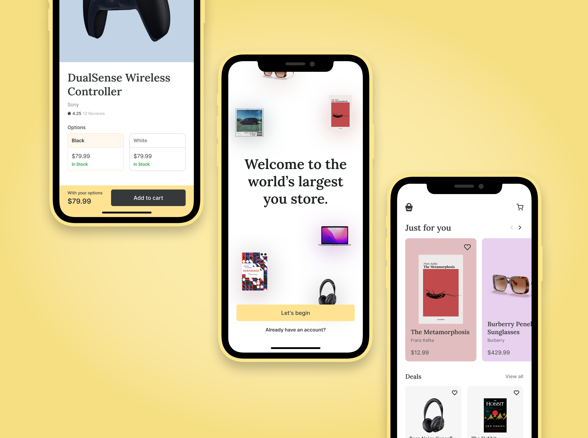
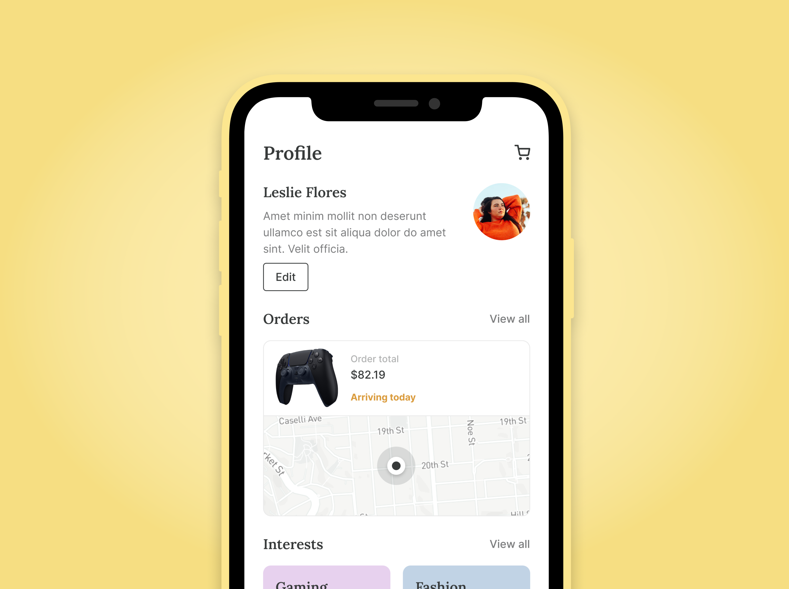
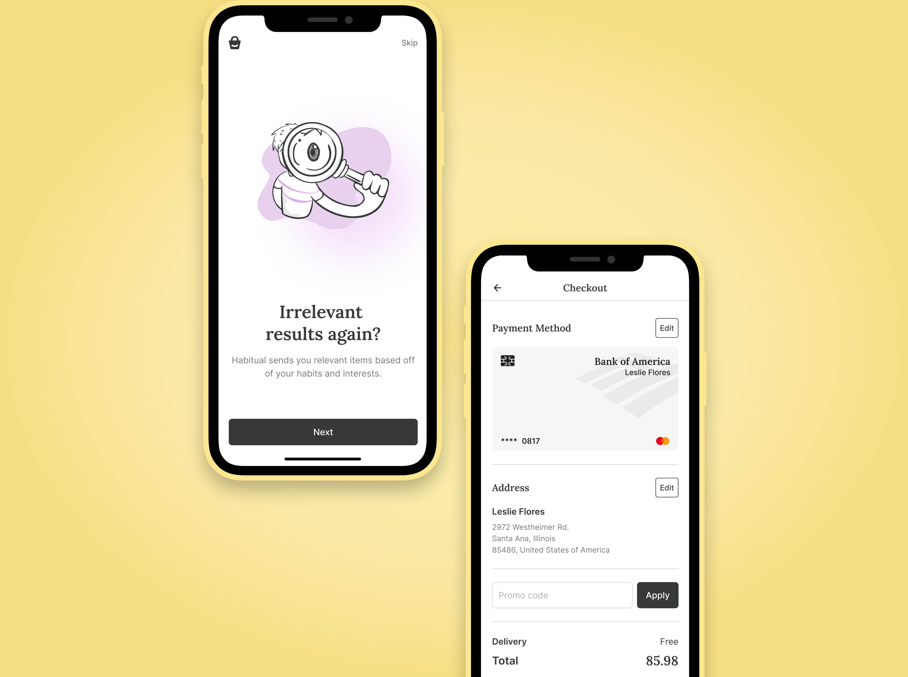
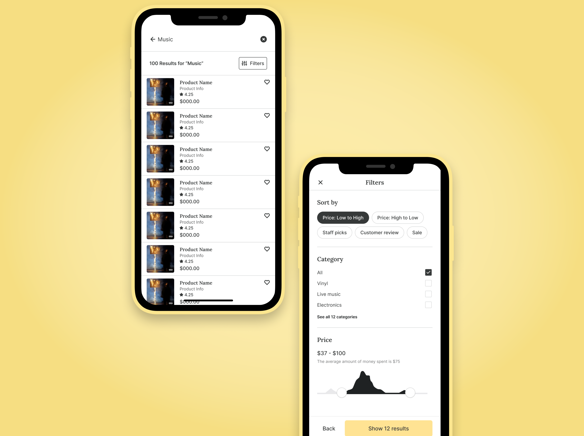

<details>
<summary>
<strong> Leia este guia em Português </strong>
</summary>
    <ul>
        <li><a href="./README-PT-BR.md"> Português </a></li>
    </ul>

</details>

### **Table of Contents**

- [**Habitual - The Flutter Ecommerce App**](#habitual---the-flutter-ecommerce-app)
  - [**Screenshots:**](#screenshots)
  - [**Pages Included:**](#pages-included)
  - [**Dependencies:**](#dependencies)
  - [**System Requirements**](#system-requirements)
  - [**Installation**](#installation)
        - [1. Clone the repository](#1-clone-the-repository)
        - [2. Move to the desired folder](#2-move-to-the-desired-folder)
        - [3. Create Android, iOS \& Web Apps](#3-create-android-ios--web-apps)
        - [4. To run the app, simply write the following commands:](#4-to-run-the-app-simply-write-the-following-commands)
  - [**Contributing**](#contributing)
  - [**License**](#license)

# **Habitual - The Flutter Ecommerce App**


Habitual is a **modern** and **intuitive** mobile shopping app that provides customers with a seamless and convenient shopping experience. This app offers fast load times, reliable performance, and smooth navigation.Habitual enables users to browse and purchase products easily.

The app has been designed with a user-centric approach, providing a clear and easy-to-use interface that allows users to find the products they're looking for quickly.

<!-- Whether you're a shopper looking for a modern and reliable mobile shopping app, or a developer looking for a high-quality Flutter project to collaborate on, Habitual has everything you need. Download it today and experience the future of mobile shopping! -->

## **Screenshots:**









## **Pages Included:**

The app includes the following pages:

- Splash Screen
- Onboarding 01
- Onboarding 02
- Onboarding 03
- Registration 01
- Registration 02
- Registration 03
- Registration 04
- Registration 05
- Sign Up
- OTP Verification
- Sign In
- Home
- Item Details
- Category
- My Cart
- Wishlist
- Checkout
- Address
- Payment
- Confirm History
- Order History
- My Profile
- Filter
- Menu
- MyReview
- My Interests
- Search

**Empty & state page:**

- Success Registration
- Success Verification
- Order Success
- Not Available
- Your Cart is empty
- Your Wishlist is Empty
- No Search Result Found
- Sign out alert
- Cart remove alert
- Wishlist remove alert

## **Dependencies:**

The app uses the following dependencies:

- GetX for state management with [`get`](https://pub.dev/packages/get)
- HTTP requests with [`http`](https://pub.dev/packages/http)
- Persistent storage with [`shared_preferences`](https://pub.dev/packages/shared_preferences) and [`flutter_secure_storage`](https://pub.dev/packages/shared_preferences)
- Image caching with [`cached_network_image`](https://pub.dev/packages/cached_network_image)
- Image cropping with [`image_cropper`](https://pub.dev/packages/image_cropper)
- Shimmer effect with [`shimmer`](https://pub.dev/packages/shimmer)
- In-app update with [`in_app_update`](https://pub.dev/packages/in_app_update)
- Internet connection checking with [`internet_connection_checker`](https://pub.dev/packages/internet_connection_checker)
- URL launching with [`url_launcher`](https://pub.dev/packages/url_launcher)
- Image picking with [`image_picker`](https://pub.dev/packages/image_picker)
- Local notifications with [`flutter_local_notifications`](https://pub.dev/packages/flutter_local_notifications)
- Internationalization with [`intl`](https://pub.dev/packages/intl)
- SVG rendering with [`flutter_svg`](https://pub.dev/packages/flutter_svg)
- Responsive UI with [`responsive_framework`](https://pub.dev/packages/responsive_framework)
- JSON serialization and deserializationwith [`json_annotation`](https://pub.dev/packages/json_annotation)
- Generating code for converting to and from JSON with [`json_serializable`](https://pub.dev/packages/json_serializable)
- Code generation for immutable classes with [`freezed`](https://pub.dev/packages/freezed)
- Annotations for the freezed code-generator with [`freezed_annotation`](https://pub.dev/packages/freezed_annotation)
- Update Flutter app launcher icon with [`flutter_Launcher_icons`](https://pub.dev/packages/flutter_launcher_icons)
- Dart code generation and modular compilation with [`build_runner`](https://pub.dev/packages/build_runner)

## **System Requirements**

- Dart SDK Version 2.19.0 or greater
- Flutter SDK Version 3.0.0 or greater.

## **Installation**

##### 1. Clone the repository

```bash
git clone https://github.com/edilsonmatola/habitual-ecommerce-app-getx.git
```

##### 2. Move to the desired folder

```bash
cd habitual-ecommerce-app-getx/
```

##### 3. Create Android, iOS & Web Apps

##### 4. To run the app, simply write the following commands:

```bash
flutter pub get
# flutter emulators --launch "emulator_id" (to get Android Simulator)
open -a simulator (to get iOS Simulator)
flutter run
flutter run -d chrome --web-renderer html (to see the best output)
```

## **Contributing**

Contributions to the app are welcome! If you'd like to contribute, please take a moment to review the **[CONTRIBUTING](./CONTRIBUTING.md)** file. This file outlines the guidelines and processes for contributing to Habitual.

If you have any questions or concerns about the contributing process, please don't hesitate to reach me out [here](https://github.com/edilsonmatola/habitual-ecommerce-getx/issues). I'm always happy to help new contributors get up to speed.

## **License**

This project is licensed under the **MIT License**. See the **[LICENSE](./LICENSE)** file for details.
